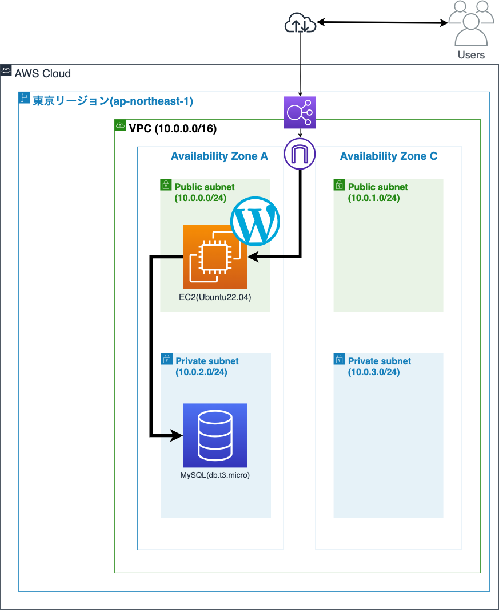

# はじめに

JAWS-UG金沢でCloudformationのハンズオン始めます。

# 事前準備
- [AWS](https://aws.amazon.com/jp/register-flow/)アカウントの準備（クレジットカードの登録も必要になるのでこちらは優先的に登録まで済ませておきましょう）
- Chrome ブラウザのインストール https://www.google.co.jp/intl/ja/chrome/browser/welcomeback.html

- ハンズオン全体の流れ、ゴールを説明し、今回のハンズオンで構築する最終的な構成について紹介します。続けてクラウドにおける構成管理について、なぜコードで管理をするのか、コードを使った運用のポイントにはどういったことがあるのかをお話しさせて頂きます。


https://pages.awscloud.com/JAPAN-event-OE-Hands-on-for-Beginners-cfn-2022-confirmation_810.html


- また以降のハンズオンで使用するファイルを以下より予めダウンロードしておいて下さい。

- ファイル：https://pages.awscloud.com/rs/112-TZM-766/images/hands-on-for-beginners-copy-and-paste-cfn.zip

- テキストエディタのタブの設定を ```2``` にしてください。

# システム図

完成イメージ

