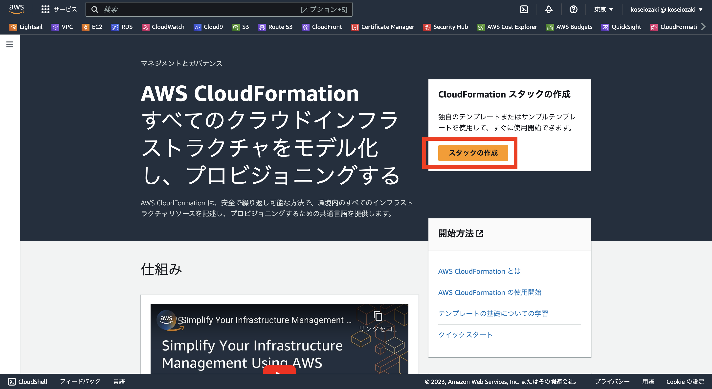

# 環境作成の事前準備

- AWS IAMでIAMユーザー作成
- IAMユーザーからアクセスキーとシークレットアクセスキーを生成してテキストファイルにメモ
- CloudFormationでAmazon VPC自動作成
- Cloud9を手動構築

# ハンズオンに必要な環境の作成

CloudFormationテンプレートのダウンロード

ハンズオンで使用するファイルを以下より予めダウンロードしておいて下さい。

ファイル：

https://pages.awscloud.com/rs/112-TZM-766/images/hands-on-for-beginners-copy-and-paste-cfn.zip

##  Cloud9に必要なVPCを自動構築

Cloud9に必要なVPCを自動構築なyamlファイル

## ダウンロード

[Cloud9-desk.yaml]()をダウンロード

[Cloudformatioinにアクセス]()

